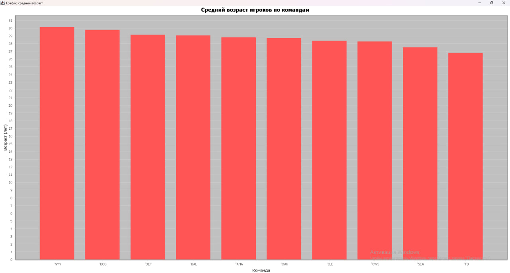
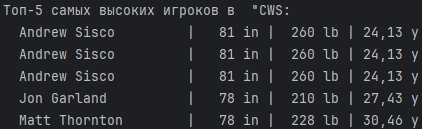
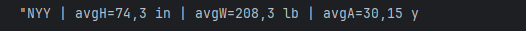

Показатели спортивных команд

## Этапы работы

1. Парсинг CSV → объекты `Player`.
2. Группировка по командам → объекты `TeamStats`.
3. Создание БД SQLite в 3НФ с помощью sqlite-jdbc: `teams`, `positions`, `players`.
4. Вставка данных в БД.
5. Выполнение трёх аналитических запросов.
6. Визуализация: график среднего возраста.
7. Вывод в консоль.

## Использованные SQL запросы:

**Средний возраст** |
```
SELECT t.abbreviation,
                   AVG(p.age) AS avg_age,
                   AVG(p.height_in) AS avg_height,
                   AVG(p.weight_lb) AS avg_weight
            FROM players p
            JOIN teams t ON p.team_id = t.team_id
            GROUP BY t.team_id
            ORDER BY avg_age DESC;
```

**Топ 5 самых высоких игроков команды** |
```
SELECT p.name, p.height_in, p.weight_lb, p.age
            FROM players p
            JOIN teams t ON p.team_id = t.team_id
            WHERE t.abbreviation = ?
            ORDER BY p.height_in DESC
            LIMIT 5;
```

**Команда по критериям** |
```
            SELECT t.abbreviation,
                   AVG(p.height_in) AS avg_height,
                   AVG(p.weight_lb) AS avg_weight,
                   AVG(p.age) AS avg_age
            FROM players p
            JOIN teams t ON p.team_id = t.team_id
            GROUP BY t.team_id
            HAVING 
                AVG(p.height_in) BETWEEN 74 AND 78
                AND AVG(p.weight_lb) BETWEEN 190 AND 210
            ORDER BY AVG(p.age) DESC
            LIMIT 1;
```
## Результаты

### 📈 Средний возраст по командам


### Команда(CWS) с самым высоким средним ростом:


### Команда по критериям (рост 74–78, вес 190–210, max возраст):
